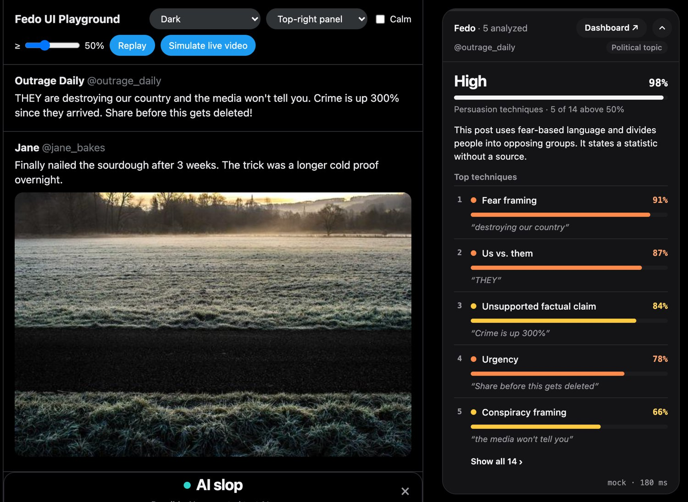

# Fedo Shield

**A Chrome extension that shows you, live in your feed, which persuasion techniques a post is using on you.**
Fear framing, us-vs-them, scapegoating, unsupported numbers, engagement bait, AI-generated images. On X and
(experimentally) TikTok, for text, pictures and the spoken words of videos.

Fedo describes **techniques, not opinions**. It never says a post is wrong, never guesses at intent, and never
hides anything. It adds context next to the post and leaves the decision to you.



*The screenshot shows the UI playground with synthetic posts (`npm run dev:ui`).*

## What it does

- **Scores every post as you scroll.** A panel follows the post in view: overall level (none / low / medium / high),
  the strongest techniques with a score, and for each one the **verbatim quote** that triggered it.
- **Reads what is written inside images.** Memes, overlaid headlines and screenshots go through the same analysis.
  A post that is nothing but a picture is no longer invisible.
- **Listens to videos.** The audio of the playing video is transcribed in short windows; scores grow while the person
  speaks, and a timeline shows *when* which technique was used ("00:20 Fear framing").
- **Flags visible signs of AI-generated images** and folds them behind a "Show post anyway" cover. Worded as an
  indication, never as proof.
- **Understands tone.** Satire, absurd jokes and memes are not treated as literal statements. Hate dressed up as
  "just joking" still is.
- **Feed Diet dashboard.** What share of your feed uses strong techniques, which ones, and from which accounts.
  Stored only in your browser.
- **Calm mode** dims high-intensity posts (one click to reveal). Four themes, two of them colour-blind safe.
- **Local or cloud, your choice.** "Local" runs a rule engine inside the extension and sends nothing anywhere.
  "Cloud" adds the language models described below.

## How the analysis works

```
post text · hashtags · quoted post · captions            ┌─ whole post ──► 15 yes/no questions ─► probability per technique
text inside images  (vision model)               ──────► │
spoken words of the video (speech-to-text)               ├─ each sentence ► same questions ────► quote + plausibility check
                                                         └─ tone ─────────► humor? sarcasm? real group targeted?
                                                                    │
                        corrections (measured, see below) ◄─────────┘
                                                                    │
                     overall level · explanation · timeline · coverage  ──►  UI
```

1. **Scores come from [Jev](https://docs.typesafe.ai/concepts/system-one)** (TypeSafe), a decision model rather than a
   chatbot: it gets the post plus one yes/no question per technique, each with explicit criteria for what counts and
   what does not, and returns a calibrated probability. A score of 0.93 means "93 % likely that this technique is
   used", not "93 % dangerous".
2. **Every sentence is scored on its own, in parallel.** The best sentence becomes the evidence quote. A technique
   that no single sentence supports is pulled down, because on aggressive posts the model otherwise rates almost
   everything at 90 %.
3. **Corrections we added after testing on real posts:**
   pattern-defined signals (a number without a source, engagement bait, AI-sounding text) also need a hit from our
   local rule engine · humor without a real target dampens sincerity-dependent signals, humor aimed at a real group
   does not · quoted posts count less than the author's own words · posts with fewer than four real words get no
   verdict at all.
4. **Overall level.** Techniques are weighted by severity (dehumanizing language 1.0 … engagement bait 0.3; a
   political *topic* counts 0). Several techniques stack with diminishing returns.
5. **Quotes are always verbatim** from the post, the image or the transcript. The model never writes them.

If the cloud is unreachable, out of credit or slow, the same pipeline runs on the local engine
(several hundred weighted patterns in English and German). The feed never shows an error because an API is down.

### The 16 signals

| Group | Signals |
|---|---|
| Rhetoric | Fear framing · Anger framing · Us vs. them · Scapegoating · Urgency · Sensational language · Personal attack · Dehumanizing language |
| Credibility | Conspiracy framing · Unsupported factual claim · Engagement bait · Commercial persuasion |
| Political | Political persuasion · Political content (*a topic tag, never counted as a technique*) |
| Synthetic | Possible AI-generated text · Synthetic media signals |

Each signal is tied to published research (propaganda-technique taxonomies, virality and inoculation studies).
The one-line references are in [`contracts/signals.ts`](contracts/signals.ts) and appear in the panel when you tap a technique.

## How we tested it

Everything in `ai/` runs in Node without a browser, so it can be measured:

| What | Result |
|---|---|
| Regression cases (`npm run eval`, `npx tsx ai/dev/eval.ts --jev`) | 15/15 local engine · 20/20 with Jev. Includes cases that must **not** fire: neutral news, sourced statistics, "they" as a plain pronoun, a zoo talking about parasites, absurd jokes |
| 328 real public posts (news, partisan accounts, satire, memes, ads, recipes) | 57 % none · 28 % low · 11 % medium · 3 % high. Hits without an evidence quote: ~85 % → ~10 % after adding sentence-level scoring |
| Latency per post (Jev, median) | ~0.4 s text · +~1 s when a picture has to be read |
| Video | speech-to-text ~1.1 s per audio window (first window 4 s, then 8 s); measured in Node, end to end |
| Images | real X image URLs, a known AI-generated picture (90 %) vs. a press photo (10 %) |

The real-post sampler (`ai/dev/fetch-live.ts`) pulls public posts without login; the raw data is deliberately not in
this repository. Findings from those runs became regression cases in [`ai/dev/cases.ts`](ai/dev/cases.ts).

## Architecture

```
 x.com / tiktok.com (content script)            background service worker
┌───────────────────────────────┐             ┌──────────────────────────────┐
│ scraper/   page → FeedItem    │  FeedItem   │ ai/   FeedItem → Result      │
│            audio → AudioChunk ├────────────►│       audio   → transcript   │
│                               │             │                              │
│ ui/        Result → panel     │◄────────────┤                              │
└───────────────────────────────┘  Result     └──────────────────────────────┘
        ▲ wired together in extension/src/ (glue, deliberately thin)
        ▲ all shared types live in contracts/ (the only interface between the three parts)
```

Three people built the three parts in parallel. They only meet in `contracts/`:
`npm run check:boundaries` fails (locally and in CI) if one part imports from another directly.

| Folder | What is in it |
|---|---|
| [`scraper/`](scraper/) | X: DOM plus interception of X's own GraphQL responses (full text, media URLs). TikTok: item JSON and caption files. Video audio capture via `captureStream()`. Research notes in [`scraper/RESEARCH.md`](scraper/RESEARCH.md) |
| [`ai/`](ai/) | Jev client, local rule engine, sentence-level evidence, tone, vision, speech-to-text, live-video throttling, timeline, overall level. Dev harnesses in `ai/dev/` |
| [`ui/`](ui/) | Panel in a shadow DOM, popup, Feed Diet dashboard, themes, playground |
| [`contracts/`](contracts/) | `FeedItem`, `AnalysisResult`, the three module interfaces, signal definitions, fixtures |
| [`extension/`](extension/) | Manifest and the glue: content script and background worker |

## Run it

```bash
git clone https://github.com/Dietrx/Fedo && cd Fedo
npm install
npm run build            # → dist/
```

Chrome → `chrome://extensions` → Developer mode → **Load unpacked** → select `dist/` → open x.com.
After every rebuild click ↻ on the extension **and reload the tab**.

Without configuration Fedo runs fully local. For the cloud features copy `.env.example` to `.env`:

```bash
FEDO_ANALYZER=jev
JEV_API_URL=https://openrouter.ai/api/alpha/decisions        # Jev via the OpenRouter Decisions API
JEV_API_KEY=<your OpenRouter key>
STT_API_URL=https://openrouter.ai/api/v1/chat/completions    # speech-to-text and vision (multimodal model)
STT_API_KEY=<your OpenRouter key>
```

Rebuild, then choose **Analysis → Cloud** in the popup. Keys are compiled into `dist/`, so never share that folder;
`.env` and `dist/` are git-ignored.

| Command | Purpose |
|---|---|
| `npm run check` | type check + boundaries + regression cases + build (this is what CI runs) |
| `npm run dev:ui` | UI playground with synthetic posts on http://localhost:8000 |
| `npm run dev:ai` | run the fixture posts through the analyzer in Node (`-- --jev` for the real API) |
| `npx tsx ai/dev/run-stt.ts <wav> --jev` | video pipeline end to end: audio → transcript → scores → timeline |
| `npx tsx ai/dev/run-vision.ts <image or url>` | image pipeline end to end |
| `npm run test:scraper` · `node --import tsx --test ui/test/*.test.ts` | unit tests |

## Privacy

- **Local mode:** nothing leaves the browser.
- **Cloud mode:** post text goes to TypeSafe (Jev), image URLs and short audio windows of the video you are watching
  go to a multimodal model, both via OpenRouter. Nothing is stored by us; there is no server of ours.
- The Feed Diet statistics live in `chrome.storage.local` and can be exported as JSON from the dashboard.
- Host permissions are limited to the configured API origin.

## Honest limits

- Videos: we analyse the **speech** and one still frame (the poster). The moving picture itself is not watched.
- "Synthetic media signals" means a model noticed typical generator artefacts in a compressed image. It is an
  indication, capped at 90 %, and a well-made fake will pass. This is not deepfake forensics.
- Jev is trained mainly on English; German works but is weaker. The local fallback engine cannot read tone or irony.
- Thresholds and corrections are calibrated on a few hundred posts, not tens of thousands. That is why the wording is
  "shows patterns of", never "is manipulation".
- X is the primary platform. TikTok support is experimental, and logged-out X pages use different markup.

## How we built it

A hackathon project by Felix Dietrich, Franz Kushnarev and Noah Heinz. Each of us owned one part and paired with an
AI coding assistant; the contract-first layout and the boundary check are what made parallel work possible without
stepping on each other. [`START_HERE.md`](START_HERE.md) is the onboarding we gave to every developer and assistant,
[`UPDATE.md`](UPDATE.md) is the running team log, [`DEMO.md`](DEMO.md) the demo run-of-show.
